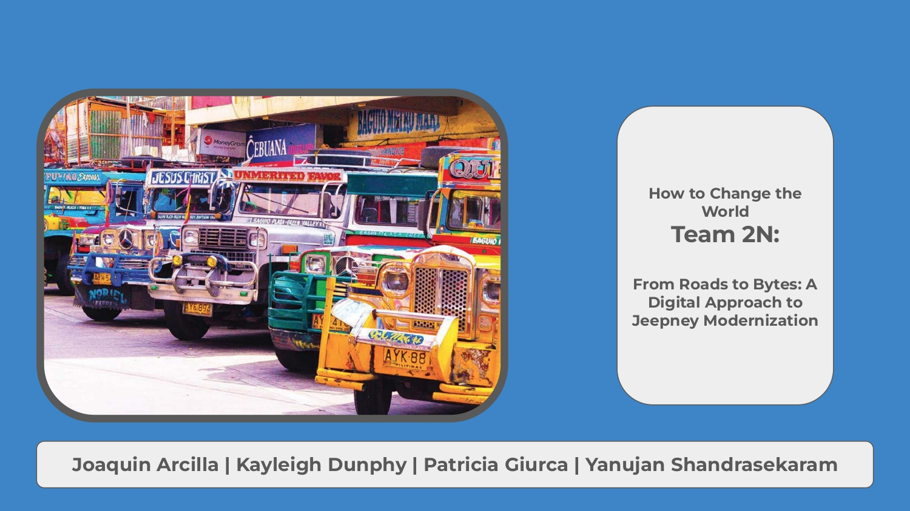

# APS330-From-Roads-to-Bytes-A-Digital-Approach-to-Jeepney-Modernization
A project with How To Change The World to improve Jeepney systems in the Philippines

This is a collection of project documents originally attatched to a Notion page that has now been deleted. All work was done by a group of team members from across Ontario Universtities:

